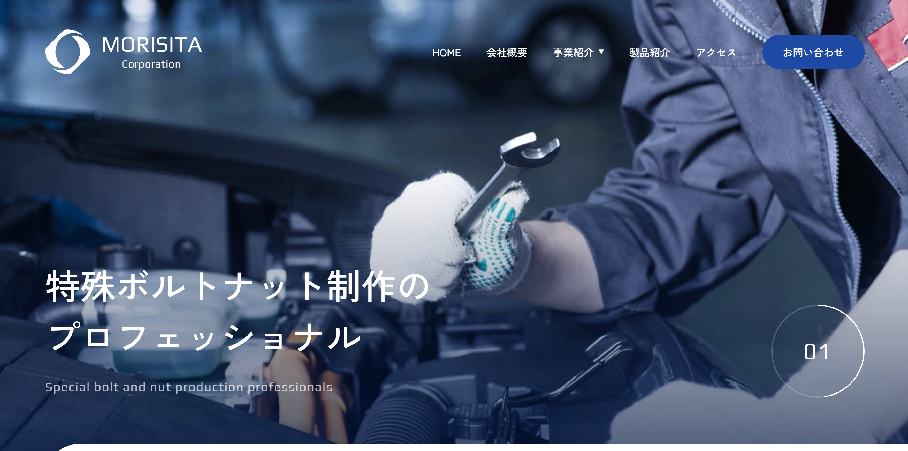

# 🌿 株式会社森下（架空サイト）

**🔗 デモ URL:** https://hiron-folio.com/portfolio/wp-works/morisita-corporation/

Hello Mentor 課題で制作した企業サイト。  
WordPress テーマを自作し、管理画面を最適化。

---

### 🖥 使用技術

WordPress / PHP / HTML / SCSS / JavaScript  
Splide スライダー / Local 開発環境

---

### 🚀 制作ポイント

- カスタム投稿 + ACF + ブロックパターンで運用しやすい構成
- コードとデザインの再利用性を意識した設計
- レスポンシブ対応（SP・PC）
- SEO SIMPLE PACK によるメタ設定

---

## 🧭 開発環境（概要）

### 必要な環境

- Node.js
- LocalWP（WordPress のローカル環境）

### 推奨エディターと拡張機能（Cursor / VS Code）

- **Live Sass Compiler**：SCSS のリアルタイムコンパイル
- **PHP Sniffer & Beautifier**：PHP コードの自動整形と規約チェック
- **Prettier**：SCSS / JS / JSON 等のコード整形

### 開発ワークフロー（概要）

1. LocalWP で WordPress を起動
2. `npm install` で依存関係をインストール
3. `npm run dev` で BrowserSync によるホットリロード開始
4. ファイル編集 → 自動リロードで確認

※ 詳細手順はこちら → [SETUP.md](./SETUP.md)

---
